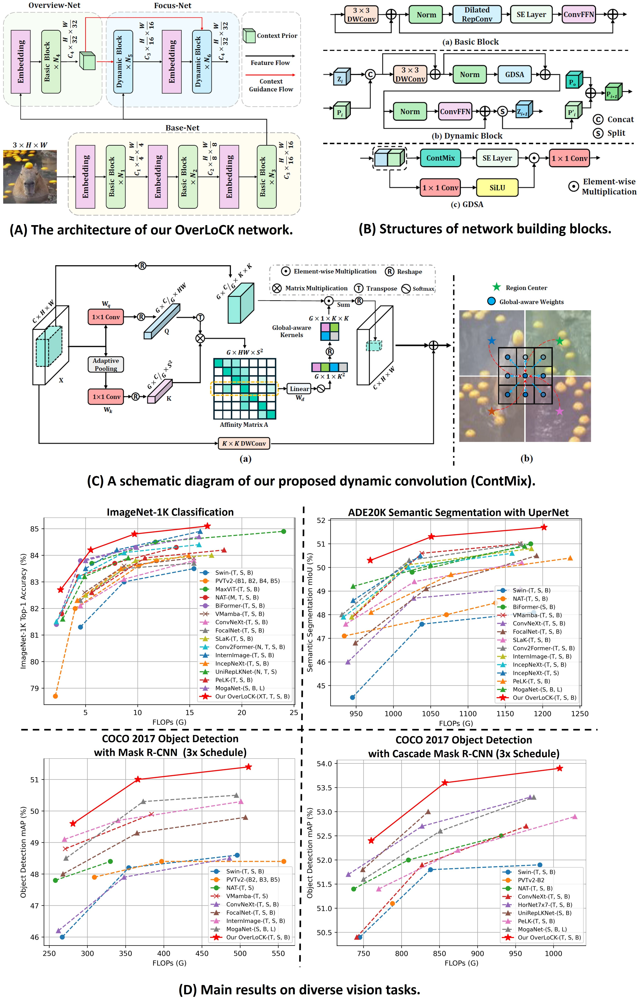

# [[CVPR 2025 Oral] OverLoCK: An Overview-first-Look-Closely-next ConvNet with Context-Mixing Dynamic Kernels](https://arxiv.org/abs/2502.20087)

This is an official PyTorch implementation of "[**OverLoCK: An Overview-first-Look-Closely-next ConvNet with Context-Mixing Dynamic Kernels**](https://arxiv.org/abs/2502.20087)".

# Introduction
Top-down attention plays a crucial role in the human vision system, wherein the brain initially obtains a rough overview of a scene to discover salient cues (i.e., overview first), followed by a more careful finer-grained examination (i.e., look closely next). However, modern ConvNets remain confined to a pyramid structure that successively downsamples the feature map for receptive field expansion, neglecting this crucial biomimetic principle. We present OverLoCK, the first pure ConvNet backbone architecture that explicitly incorporates a top-down attention mechanism. Unlike pyramid backbone networks, our design features a branched architecture with three synergistic sub-networks: 1) a Base-Net that encodes low/mid-level features; 2) a lightweight Overview-Net that generates dynamic top-down attention through coarse global context modeling (i.e., overview first); and 3) a robust Focus-Net that performs finer-grained perception guided by top-down attention (i.e., look closely next). To fully unleash the power of top-down attention, we further propose a novel context-mixing dynamic convolution (ContMix) that effectively models long-range dependencies while preserving inherent local inductive biases even when the input resolution increases, addressing critical limitations in existing convolutions. Our OverLoCK exhibits a notable performance improvement over existing methods.
<center> 

</center>

# Image Classification

## 1. Requirements
We highly suggest using our provided dependencies to ensure reproducibility:
```
# Environments:
cuda==12.1
python==3.10
# Dependencies:
pip install torch==2.3.1 torchvision==0.18.1 --index-url https://download.pytorch.org/whl/cu121
pip install natten==0.17.1+torch230cu121 -f https://shi-labs.com/natten/wheels/
pip install timm==0.6.12
pip install mmengine==0.2.0
```
>💡 To accelerate training and inference, we utilize the efficient large-kernel convolution proposed in [RepLKNet](https://github.com/DingXiaoH/RepLKNet-pytorch#use-our-efficient-large-kernel-convolution-with-pytorch). Please follow this [**guideline**](https://github.com/VITA-Group/SLaK#installation) to install the ``depthwise_conv2d_implicit_gemm`` function.
>
>💡 If you encounter network issues during the installation of ``natten``, please download this [**package**](https://github.com/LMMMEng/OverLoCK/releases/download/v1/natten-0.17.1+torch230cu121-cp310-cp310-linux_x86_64.whl) and install it locally.


## 2. Data Preparation
Prepare [ImageNet](https://image-net.org/) with the following folder structure, you can extract ImageNet by this [script](https://gist.github.com/BIGBALLON/8a71d225eff18d88e469e6ea9b39cef4).

```
│imagenet/
├──train/
│  ├── n01440764
│  │   ├── n01440764_10026.JPEG
│  │   ├── n01440764_10027.JPEG
│  │   ├── ......
│  ├── ......
├──val/
│  ├── n01440764
│  │   ├── ILSVRC2012_val_00000293.JPEG
│  │   ├── ILSVRC2012_val_00002138.JPEG
│  │   ├── ......
│  ├── ......
```

## 3. Main Results on ImageNet-1K with Pretrained Models

| Models      | Input Size | FLOPs (G) | Params (M) | Top-1 (%) | Download |
|:-----------:|:----------:|:---------:|:----------:|:----------:|:----------:|
| OverLoCK-XT | 224x224    | 2.6       | 16       | 82.7       | [model](https://github.com/LMMMEng/OverLoCK/releases/download/v1/overlock_xt_in1k_224.pth)     |
| OverLoCK-T | 224x224    | 5.5       | 33      | 84.2       | [model](https://github.com/LMMMEng/OverLoCK/releases/download/v1/overlock_t_in1k_224.pth)     |
| OverLoCK-S | 224x224    | 9.7      | 56       | 84.8       | [model](https://github.com/LMMMEng/OverLoCK/releases/download/v1/overlock_s_in1k_224.pth)     |
| OverLoCK-B | 224x224    | 16.7       | 95       | 85.1       | [model](https://github.com/LMMMEng/OverLoCK/releases/download/v1/overlock_b_in1k_224.pth)     |

## 4. Train
To train ```OverLoCK``` models on ImageNet-1K with 8 gpus (single node), run:
```
bash scripts/train_xt_model.sh # train OverLoCK-XT
bash scripts/train_t_model.sh  # train OverLoCK-T
bash scripts/train_s_model.sh  # train OverLoCK-S
bash scripts/train_b_model.sh  # train OverLoCK-B
```  
> 💡If you encounter NaN loss, please delete ``--native-amp`` to disable AMP training and resume the checkpoint before the NaN loss occurred.
>   
> 💡If your GPU memory is insufficient, you can enable gradient checkpointing by adding the following arguments: ``--grad-checkpoint --ckpt-stg 4 0 0 0``. If you're still experiencing memory issues, you can increase these values, but be aware that this may slow down training.

## 5. Validation
To evaluate ```OverLoCK``` on ImageNet-1K, run:
```
MODEL=overlock_xt # overlock_{xt, t, s, b}
python3 validate.py \
/path/to/imagenet \
--model $MODEL -b 128 \
--pretrained # or --checkpoint /path/to/checkpoint 
```
>💡 To accelerate inference speed, OverLoCK utilizes [**Structural Re-parameterization**](https://github.com/AILab-CVC/UniRepLKNet/tree/main). Please refer to [**here**](https://github.com/LMMMEng/OverLoCK/blob/540bf6ed9cca99eab78fc8ab935b71f2a4aa2a2c/models/overlock.py#L945) for a simple usage instruction.

# Citation
If you find this project useful for your research, please consider citing:
```
@inproceedings{lou2025overlock,
  title={OverLoCK: An Overview-first-Look-Closely-next ConvNet with Context-Mixing Dynamic Kernels},
  author={Lou, Meng and Yu, Yizhou},
  booktitle={IEEE/CVF Conference on Computer Vision and Pattern Recognition (CVPR)},
  pages={128--138},
  year={2025}
}
```

# Acknowledgment
Our implementation is mainly based on the following codebases. We gratefully thank the authors for their wonderful works.  
> [timm](https://github.com/rwightman/pytorch-image-models), [natten](https://github.com/SHI-Labs/NATTEN), [unireplknet](https://github.com/AILab-CVC/UniRepLKNet), [mmcv](https://github.com/open-mmlab/mmcv), [mmdet](https://github.com/open-mmlab/mmdetection), [mmseg](https://github.com/open-mmlab/mmsegmentation)  

# Contact
If you have any questions, please feel free to [create issues❓](https://github.com/LMMMEng/OverLoCK/issues) or [contact me 📧](lmzmm.0921@gmail.com).
